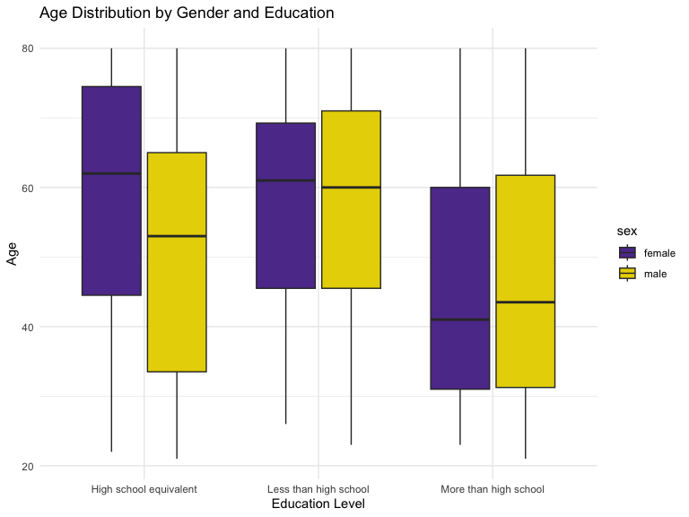
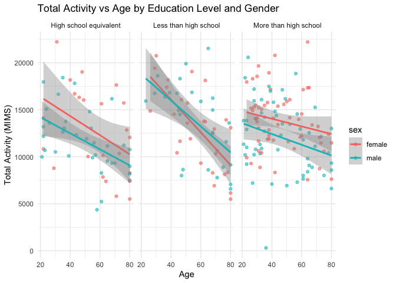
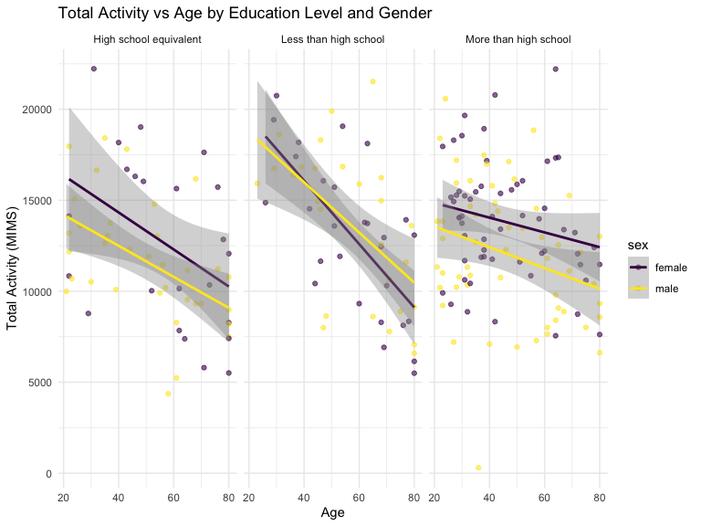
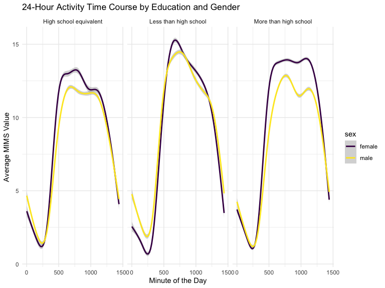

p8105_hw3_zz3166
================
Zihan Zhao
2024-10-10

``` r
library(p8105.datasets)
library(tidyverse)
```

    ## ── Attaching core tidyverse packages ──────────────────────── tidyverse 2.0.0 ──
    ## ✔ dplyr     1.1.4     ✔ readr     2.1.5
    ## ✔ forcats   1.0.0     ✔ stringr   1.5.1
    ## ✔ ggplot2   3.5.1     ✔ tibble    3.2.1
    ## ✔ lubridate 1.9.3     ✔ tidyr     1.3.1
    ## ✔ purrr     1.0.2     
    ## ── Conflicts ────────────────────────────────────────── tidyverse_conflicts() ──
    ## ✖ dplyr::filter() masks stats::filter()
    ## ✖ dplyr::lag()    masks stats::lag()
    ## ℹ Use the conflicted package (<http://conflicted.r-lib.org/>) to force all conflicts to become errors

``` r
library(dplyr)
library(tidyr)
library(readr)
library(ggridges)
library(patchwork)
library(knitr)
library(janitor)
```

    ## 
    ## Attaching package: 'janitor'
    ## 
    ## The following objects are masked from 'package:stats':
    ## 
    ##     chisq.test, fisher.test

``` r
knitr::opts_chunk$set(
    echo = TRUE,
    warning = FALSE,
    fig.width = 8, 
  fig.height = 6,
  out.width = "90%"
)

theme_set(theme_minimal() + theme(legend.position = "bottom"))

options(
  ggplot2.continuous.colour = "viridis",
  ggplot2.continuous.fill = "viridis"
)

scale_colour_discrete = scale_colour_viridis_d
scale_fill_discrete = scale_fill_viridis_d

data("ny_noaa")
```

## Problem 1

Dataset Overview

``` r
str(ny_noaa)
```

    ## tibble [2,595,176 × 7] (S3: tbl_df/tbl/data.frame)
    ##  $ id  : chr [1:2595176] "US1NYAB0001" "US1NYAB0001" "US1NYAB0001" "US1NYAB0001" ...
    ##  $ date: Date[1:2595176], format: "2007-11-01" "2007-11-02" ...
    ##  $ prcp: int [1:2595176] NA NA NA NA NA NA NA NA NA NA ...
    ##  $ snow: int [1:2595176] NA NA NA NA NA NA NA NA NA NA ...
    ##  $ snwd: int [1:2595176] NA NA NA NA NA NA NA NA NA NA ...
    ##  $ tmax: chr [1:2595176] NA NA NA NA ...
    ##  $ tmin: chr [1:2595176] NA NA NA NA ...
    ##  - attr(*, "spec")=
    ##   .. cols(
    ##   ..   id = col_character(),
    ##   ..   date = col_date(format = ""),
    ##   ..   prcp = col_integer(),
    ##   ..   snow = col_integer(),
    ##   ..   snwd = col_integer(),
    ##   ..   tmax = col_character(),
    ##   ..   tmin = col_character()
    ##   .. )

``` r
dim(ny_noaa)
```

    ## [1] 2595176       7

#### Answer questions about the data

This dataset contains 2595176 rows and 7 columns. Variables include
weather station id, date of observation, (tenths of mm), snowfall (mm),
snow depth (mm), and min and max temperature (tenths of degrees C).

Below we clean the data, creating separate variables for year, month,
and day and converting `tmax` and `tmin` to numeric. We find that 0 is
the most commonly observed value for snowfall. This is because most days
of the year, it does not snow at all in NY. The second most commonly
observed value is `NA`, indicating missingness. Other common values are
13, 25, and 51, suggesting that snowfall is originally recorded in
fractions of an inch and converted to mm.

``` r
ny_noaa %>% 
  count(snow) %>%
  arrange(desc(n))
```

    ## # A tibble: 282 × 2
    ##     snow       n
    ##    <int>   <int>
    ##  1     0 2008508
    ##  2    NA  381221
    ##  3    25   31022
    ##  4    13   23095
    ##  5    51   18274
    ##  6    76   10173
    ##  7     8    9962
    ##  8     5    9748
    ##  9    38    9197
    ## 10     3    8790
    ## # ℹ 272 more rows

``` r
ny_noaa = 
  ny_noaa %>% 
  separate(date, into = c("year", "month", "day"), convert = TRUE) %>% 
  mutate(
    tmax = as.numeric(tmax),
    tmin = as.numeric(tmin))
```

Below is a two-panel plot showing the average max temperature in January
and in July in each station across years. As expected, the mean
temperature in January is much lower than the mean temperature in July
for all stations and across all years. All stations appear to follow
similar trends of temperature peaks and valleys within a month across
the years, i.e. when one station has a high monthly mean temperature for
a given year, most other stations also have a high monthly mean
temperature for that year. We do see one uncharacteristically cold
station in July of 1987 or 1988, as well as a few other less drastic
outliers.

``` r
ny_noaa %>% 
  group_by(id, year, month) %>% 
  filter(month %in% c(1, 7)) %>% 
  summarize(mean_tmax = mean(tmax, na.rm = TRUE, color = id)) %>% 
  ggplot(aes(x = year, y = mean_tmax, group = id)) + geom_point() + geom_path() +
  facet_grid(~month) +
  labs(title = "Mean monthly temperature for each station across years for January and July")
```

    ## `summarise()` has grouped output by 'id', 'year'. You can override using the
    ## `.groups` argument.



Below we show a two-panel plot including (i) a hex plot of `tmax` vs
`tmin` for the full dataset; and (ii) a ridge plot showing the
distribution of snowfall values (in mm) greater than 0 and less than 100
separately by year.

From the hex plot we see that while there is some variability, the
majority of the data cluster tightly in the center of the distribution.
In relatively rare cases, it seems that `tmax` is less than `tmin`,
which raises questions about data recording and quality.

From the ridge plot, we see a multimodal density of snowfall within a
given year. Most stations see between 0 and 35 mm of snow in a year.
Then there is a another group of stations that see about 45 mm of snow,
and another group that sees nearly 80 mm. It is likely this
multimodality stems from the conversion of measurements in one system
(fractions of an inch) to another (using the metric system), which was
also noted in the table of common values.

``` r
hex = 
  ny_noaa %>% 
  ggplot(aes(x = tmin, y = tmax)) + 
  geom_hex()

ridge = 
  
  ny_noaa %>% 
  filter(snow < 100, snow > 0) %>%
  ggplot(aes(x = snow, y = as.factor(year))) + 
  geom_density_ridges()

hex + ridge
```

    ## Picking joint bandwidth of 3.76



## Problem 2

We start by loading the two datasets: demographic data (`covar`) and
accelerometer data (`accel`). We clean the demographic data by renaming
columns, recoding categorical variables, and filtering out participants
below 21 years of age. Missing data is also removed.

``` r
# Step 1: Load demographic data
covar <- read_csv("nhanes_covar.csv", skip=4 ) |>
   janitor::clean_names() |>
     mutate(
       sex = recode(sex, "1" = "male", "2" = "female"),
       education = recode(education, "1" = "Less than high school", "2" = "High school equivalent", "3" = "More than high school")
     ) |>
   mutate (
     sex = factor(sex),
     education = factor(education)
   )
```

    ## Rows: 250 Columns: 5
    ## ── Column specification ────────────────────────────────────────────────────────
    ## Delimiter: ","
    ## dbl (5): SEQN, sex, age, BMI, education
    ## 
    ## ℹ Use `spec()` to retrieve the full column specification for this data.
    ## ℹ Specify the column types or set `show_col_types = FALSE` to quiet this message.

``` r
clean_covar <- covar |>
  filter(age >= 21)|>
  drop_na()
# Load accelerometer data
accel <- read_csv("nhanes_accel.csv") |>
    janitor::clean_names() 
```

    ## Rows: 250 Columns: 1441
    ## ── Column specification ────────────────────────────────────────────────────────
    ## Delimiter: ","
    ## dbl (1441): SEQN, min1, min2, min3, min4, min5, min6, min7, min8, min9, min1...
    ## 
    ## ℹ Use `spec()` to retrieve the full column specification for this data.
    ## ℹ Specify the column types or set `show_col_types = FALSE` to quiet this message.

``` r
    merged_data <- merge(clean_covar, accel, by = "seqn")
```

First, I cleaned the demographic data by renaming columns and recoding
categorical variables such as `sex` and `education` into meaningful
labels. I also filtered out participants under the age of 21 and removed
any rows with missing demographic data. The accelerometer data was
loaded and merged with the cleaned demographic data using `SEQN` as the
common identifier.

Next, I created a summary table to display the number of men and women
in each education category.

``` r
# Step 2: Create a table for the number of men and women in each education category
education_gender_table <- merged_data |>
  group_by(education, sex) |>
  summarise(count = n(), .groups = "drop") |>
  tidyr::pivot_wider(names_from = sex, values_from = count, values_fill = 0)

# Display the table
knitr::kable(education_gender_table, caption = "Number of Men and Women in Each Education Category")
```

| education              | female | male |
|:-----------------------|-------:|-----:|
| High school equivalent |     23 |   35 |
| Less than high school  |     28 |   27 |
| More than high school  |     59 |   56 |

Number of Men and Women in Each Education Category

This code groups the `merged_data` by `education` and `sex` and counts
the number of participants in each group. Then, `pivot_wider()` is used
to spread the `sex` variable across columns, resulting in a table that
shows the number of men and women in each education category.

``` r
# Step 3: Boxplot of age distribution by education level and gender
ggplot(merged_data, aes(x = education, y = age, fill = sex)) +
  geom_boxplot() +
  labs(title = "Age Distribution by Gender and Education", x = "Education Level", y = "Age") +
  theme_minimal() +
  scale_fill_manual(values = c("male" = "blue", "female" = "red")) # Optional: Add custom colors for clarity
```


The boxplot shows that participants with less education (“Less than high
school”) tend to be older, with both men and women having higher median
ages compared to those with higher education. Men in the “More than high
school” category exhibit a wider age range compared to women. Overall,
there is more variability in age among men than women in higher
education categories, while the age distributions for men and women in
the “High school equivalent” group are more similar.

``` r
# Step 4: Calculate total activity per participant by summing minute-wise activity (MIMS values)
total_activity_data <- merged_data |>
  rowwise() |>
  mutate(total_activity = sum(c_across(starts_with("min")), na.rm = TRUE))

# Plot total activity against age with panels for education and color for gender
ggplot(total_activity_data, aes(x = age, y = total_activity, color = sex)) +
  geom_point(alpha = 0.6) +
  geom_smooth(method = "lm") +
  facet_wrap(~ education) +
  labs(title = "Total Activity vs Age by Education Level and Gender", 
       x = "Age", 
       y = "Total Activity (MIMS)") +
  theme_minimal()
```

    ## `geom_smooth()` using formula = 'y ~ x'


The plot shows that total activity decreases with age across all
education levels for both men and women. The trend is more pronounced in
participants with “Less than high school” education, where both men and
women exhibit steep declines in activity as they age. In the “More than
high school” group, men tend to have slightly higher activity levels
than women, while in the “High school equivalent” group, the difference
between men and women is smaller. Overall, the negative association
between age and activity is consistent, though the decline rate and
gender differences vary by education level.

``` r
# Step 5: 24-Hour Activity Time Course by Education Level and Gender
time_course_data <- merged_data |>
  pivot_longer(cols = starts_with("min"), names_to = "minute", values_to = "MIMS_value") |>
  mutate(minute = as.numeric(gsub("min", "", minute)))

ggplot(time_course_data, aes(x = minute, y = MIMS_value, color = sex)) +
  geom_smooth() +
  facet_wrap(~ education) +
  labs(title = "24-Hour Activity Time Course by Education and Gender", 
       x = "Minute of the Day", 
       y = "Average MIMS Value") +
  theme_minimal()
```

    ## `geom_smooth()` using method = 'gam' and formula = 'y ~ s(x, bs = "cs")'


The plot shows similar 24-hour activity patterns for men and women
across all education levels, with peaks during the day and drops at
night. Women generally exhibit slightly higher activity levels than men,
particularly in the “Less than high school” and “More than high school”
groups. Activity patterns are consistent, with minor gender differences
in peak times.

## Problem 3
