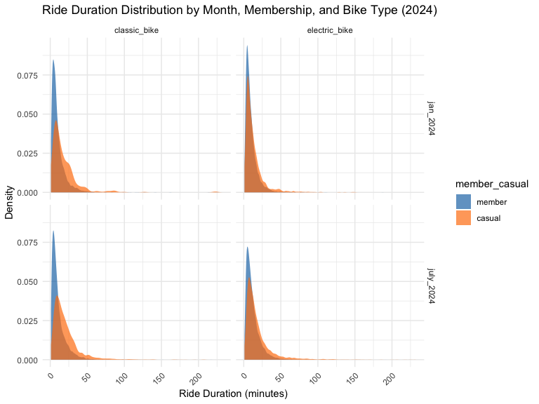

p8105_hw3_zz3166
================
Zihan Zhao
2024-10-10

``` r
library(p8105.datasets)
library(tidyverse)
```

    ## ── Attaching core tidyverse packages ──────────────────────── tidyverse 2.0.0 ──
    ## ✔ dplyr     1.1.4     ✔ readr     2.1.5
    ## ✔ forcats   1.0.0     ✔ stringr   1.5.1
    ## ✔ ggplot2   3.5.1     ✔ tibble    3.2.1
    ## ✔ lubridate 1.9.3     ✔ tidyr     1.3.1
    ## ✔ purrr     1.0.2     
    ## ── Conflicts ────────────────────────────────────────── tidyverse_conflicts() ──
    ## ✖ dplyr::filter() masks stats::filter()
    ## ✖ dplyr::lag()    masks stats::lag()
    ## ℹ Use the conflicted package (<http://conflicted.r-lib.org/>) to force all conflicts to become errors

``` r
library(dplyr)
library(tidyr)
library(readr)
library(ggridges)
library(patchwork)
library(knitr)
library(janitor)
```

    ## 
    ## Attaching package: 'janitor'
    ## 
    ## The following objects are masked from 'package:stats':
    ## 
    ##     chisq.test, fisher.test

``` r
library(ggplot2)
library(kableExtra)
```

    ## 
    ## Attaching package: 'kableExtra'
    ## 
    ## The following object is masked from 'package:dplyr':
    ## 
    ##     group_rows

``` r
knitr::opts_chunk$set(
    echo = TRUE,
    warning = FALSE,
    fig.width = 8, 
  fig.height = 6,
  out.width = "90%"
)

theme_set(theme_minimal() + theme(legend.position = "bottom"))

options(
  ggplot2.continuous.colour = "viridis",
  ggplot2.continuous.fill = "viridis"
)

scale_colour_discrete = scale_colour_viridis_d
scale_fill_discrete = scale_fill_viridis_d

data("ny_noaa")
```

## Problem 2

We start by loading the two datasets: demographic data (`covar`) and
accelerometer data (`accel`). We clean the demographic data by renaming
columns, recoding categorical variables, and filtering out participants
below 21 years of age. Missing data is also removed.

``` r
# Step 1: Load demographic data
covar <- read_csv("nhanes_covar.csv", skip=4 ) |>
   janitor::clean_names() |>
     mutate(
       sex = recode(sex, "1" = "male", "2" = "female"),
       education = recode(education, "1" = "Less than high school", "2" = "High school equivalent", "3" = "More than high school")
     ) |>
   mutate (
     sex = factor(sex),
     education = factor(education)
   )
```

    ## Rows: 250 Columns: 5
    ## ── Column specification ────────────────────────────────────────────────────────
    ## Delimiter: ","
    ## dbl (5): SEQN, sex, age, BMI, education
    ## 
    ## ℹ Use `spec()` to retrieve the full column specification for this data.
    ## ℹ Specify the column types or set `show_col_types = FALSE` to quiet this message.

``` r
clean_covar <- covar |>
  filter(age >= 21)|>
  drop_na()
# Load accelerometer data
accel <- read_csv("nhanes_accel.csv") |>
    janitor::clean_names() 
```

    ## Rows: 250 Columns: 1441
    ## ── Column specification ────────────────────────────────────────────────────────
    ## Delimiter: ","
    ## dbl (1441): SEQN, min1, min2, min3, min4, min5, min6, min7, min8, min9, min1...
    ## 
    ## ℹ Use `spec()` to retrieve the full column specification for this data.
    ## ℹ Specify the column types or set `show_col_types = FALSE` to quiet this message.

``` r
    merged_data <- merge(clean_covar, accel, by = "seqn")
```

First, I cleaned the demographic data by renaming columns and recoding
categorical variables such as `sex` and `education` into meaningful
labels. I also filtered out participants under the age of 21 and removed
any rows with missing demographic data. The accelerometer data was
loaded and merged with the cleaned demographic data using `SEQN` as the
common identifier.

Next, I created a summary table to display the number of men and women
in each education category.

``` r
# Step 2: Create a table for the number of men and women in each education category
education_gender_table <- merged_data |>
  group_by(education, sex) |>
  summarise(count = n(), .groups = "drop") |>
  tidyr::pivot_wider(names_from = sex, values_from = count, values_fill = 0)

# Display the table
knitr::kable(education_gender_table, caption = "Number of Men and Women in Each Education Category")
```

| education              | female | male |
|:-----------------------|-------:|-----:|
| High school equivalent |     23 |   35 |
| Less than high school  |     28 |   27 |
| More than high school  |     59 |   56 |

Number of Men and Women in Each Education Category

This code groups the `merged_data` by `education` and `sex` and counts
the number of participants in each group. Then, `pivot_wider()` is used
to spread the `sex` variable across columns, resulting in a table that
shows the number of men and women in each education category.

``` r
# Step 3: Boxplot of age distribution by education level and gender
ggplot(merged_data, aes(x = education, y = age, fill = sex)) +
  geom_boxplot() +
  labs(title = "Age Distribution by Gender and Education", x = "Education Level", y = "Age") +
  theme_minimal() +
  scale_fill_manual(values = c("male" = "#e7d400", "female" = "#5e3c99")) # Optional: Add custom colors for clarity
```


The boxplot shows that participants with less education (“Less than high
school”) tend to be older, with both men and women having higher median
ages compared to those with higher education. Men in the “More than high
school” category exhibit a wider age range compared to women. Overall,
there is more variability in age among men than women in higher
education categories, while the age distributions for men and women in
the “High school equivalent” group are more similar.

``` r
# Step 4: Calculate total activity per participant by summing minute-wise activity (MIMS values)
total_activity_data <- merged_data |>
  rowwise() |>
  mutate(total_activity = sum(c_across(starts_with("min")), na.rm = TRUE))

# Plot total activity against age with panels for education and color for gender
ggplot(total_activity_data, aes(x = age, y = total_activity, color = sex)) +
  geom_point(alpha = 0.6) +
  geom_smooth(method = "lm") +
  facet_wrap(~ education) +
  labs(title = "Total Activity vs Age by Education Level and Gender", 
       x = "Age", 
       y = "Total Activity (MIMS)") +
  theme_minimal()
```

    ## `geom_smooth()` using formula = 'y ~ x'


The plot shows that total activity decreases with age across all
education levels for both men and women. The trend is more pronounced in
participants with “Less than high school” education, where both men and
women exhibit steep declines in activity as they age. In the “More than
high school” group, men tend to have slightly higher activity levels
than women, while in the “High school equivalent” group, the difference
between men and women is smaller. Overall, the negative association
between age and activity is consistent, though the decline rate and
gender differences vary by education level.

``` r
# Step 5: 24-Hour Activity Time Course by Education Level and Gender
time_course_data <- merged_data |>
  pivot_longer(cols = starts_with("min"), names_to = "minute", values_to = "MIMS_value") |>
  mutate(minute = as.numeric(gsub("min", "", minute)))

ggplot(time_course_data, aes(x = minute, y = MIMS_value, color = sex)) +
  geom_smooth() +
  facet_wrap(~ education) +
  labs(title = "24-Hour Activity Time Course by Education and Gender", 
       x = "Minute of the Day", 
       y = "Average MIMS Value") +
  theme_minimal()
```

    ## `geom_smooth()` using method = 'gam' and formula = 'y ~ s(x, bs = "cs")'


The plot shows similar 24-hour activity patterns for men and women
across all education levels, with peaks during the day and drops at
night. Women generally exhibit slightly higher activity levels than men,
particularly in the “Less than high school” and “More than high school”
groups. Activity patterns are consistent, with minor gender differences
in peak times.

## Problem 3

``` r
# Load and clean January 2020 data
jan20_df = 
  read_csv("Jan 2020 Citi.csv", na = c("NA", ".", "")) |> 
  janitor::clean_names() |> 
  drop_na() |>
  mutate(month_year = "jan_2020")
```

    ## Rows: 12420 Columns: 7
    ## ── Column specification ────────────────────────────────────────────────────────
    ## Delimiter: ","
    ## chr (6): ride_id, rideable_type, weekdays, start_station_name, end_station_n...
    ## dbl (1): duration
    ## 
    ## ℹ Use `spec()` to retrieve the full column specification for this data.
    ## ℹ Specify the column types or set `show_col_types = FALSE` to quiet this message.

``` r
# Load and clean January 2024 data
jan24_df = 
  read_csv("Jan 2024 Citi.csv", na = c("NA", ".", "")) |> 
  janitor::clean_names() |> 
  drop_na() |>
  mutate(month_year = "jan_2024")
```

    ## Rows: 18861 Columns: 7
    ## ── Column specification ────────────────────────────────────────────────────────
    ## Delimiter: ","
    ## chr (6): ride_id, rideable_type, weekdays, start_station_name, end_station_n...
    ## dbl (1): duration
    ## 
    ## ℹ Use `spec()` to retrieve the full column specification for this data.
    ## ℹ Specify the column types or set `show_col_types = FALSE` to quiet this message.

``` r
# Load and clean July 2020 data
july20_df = 
  read_csv("July 2020 Citi.csv", na = c("NA", ".", "")) |> 
  janitor::clean_names() |> 
  drop_na() |>
  mutate(month_year = "july_2020")
```

    ## Rows: 21048 Columns: 7
    ## ── Column specification ────────────────────────────────────────────────────────
    ## Delimiter: ","
    ## chr (6): ride_id, rideable_type, weekdays, start_station_name, end_station_n...
    ## dbl (1): duration
    ## 
    ## ℹ Use `spec()` to retrieve the full column specification for this data.
    ## ℹ Specify the column types or set `show_col_types = FALSE` to quiet this message.

``` r
# Load and clean July 2024 data
july24_df = 
  read_csv("July 2024 Citi.csv", na = c("NA", ".", "")) |> 
  janitor::clean_names() |> 
  drop_na() |>
  mutate(month_year = "july_2024")
```

    ## Rows: 47156 Columns: 7
    ## ── Column specification ────────────────────────────────────────────────────────
    ## Delimiter: ","
    ## chr (6): ride_id, rideable_type, weekdays, start_station_name, end_station_n...
    ## dbl (1): duration
    ## 
    ## ℹ Use `spec()` to retrieve the full column specification for this data.
    ## ℹ Specify the column types or set `show_col_types = FALSE` to quiet this message.

``` r
# Combine all datasets and encode variables
citi_df = 
  bind_rows(jan20_df, july20_df, jan24_df, july24_df) |> 
  mutate(
    month_year = factor(month_year, levels = c("jan_2020", "july_2020", "jan_2024", "july_2024"), ordered = TRUE),
    weekdays = factor(weekdays, levels = c("Monday", "Tuesday", "Wednesday", "Thursday", "Friday", "Saturday", "Sunday")),
    rideable_type = factor(rideable_type),  # Encode bike type as factor
    member_casual = factor(member_casual, levels = c("member", "casual"))  # Encode membership type as factor
  )

str(citi_df)
```

    ## tibble [99,253 × 8] (S3: tbl_df/tbl/data.frame)
    ##  $ ride_id           : chr [1:99253] "4BE06CB33B037044" "26886E034974493B" "24DC56060EBE6260" "EEDC1053582D02E5" ...
    ##  $ rideable_type     : Factor w/ 2 levels "classic_bike",..: 1 1 1 1 1 1 1 1 1 1 ...
    ##  $ weekdays          : Factor w/ 7 levels "Monday","Tuesday",..: 2 3 5 7 5 7 7 7 4 2 ...
    ##  $ duration          : num [1:99253] 15.33 5.31 9.69 7 2.85 ...
    ##  $ start_station_name: chr [1:99253] "Columbus Ave & W 95 St" "2 Ave & E 96 St" "Columbia St & Rivington St" "W 84 St & Columbus Ave" ...
    ##  $ end_station_name  : chr [1:99253] "E 53 St & Madison Ave" "1 Ave & E 110 St" "Grand St & Elizabeth St" "Columbus Ave & W 72 St" ...
    ##  $ member_casual     : Factor w/ 2 levels "member","casual": 1 1 1 1 1 1 1 1 1 1 ...
    ##  $ month_year        : Ord.factor w/ 4 levels "jan_2020"<"july_2020"<..: 1 1 1 1 1 1 1 1 1 1 ...

``` r
# Step 2: Summarise total rides by membership type and month_year
ride_summary = citi_df |> 
  group_by(member_casual, month_year) |> 
  summarise(total_rides = n(), .groups = 'drop') |>
  tidyr::pivot_wider(names_from = month_year, values_from = total_rides)
# Create a better-formatted table using kableExtra
ride_summary |> 
  kbl(caption = "Total Rides by Member Type, Year, and Month") |> 
  kable_classic(full_width = F, html_font = "Cambria") |> 
  column_spec(1, bold = TRUE) |>  # Bold the first column (member type)
  column_spec(2:5, width = "5em") |>  # Adjust the column width for a consistent look
  row_spec(0, bold = TRUE, background = "#D3D3D3")  # Bold and shade the header row
```

<table class=" lightable-classic" style="font-family: Cambria; width: auto !important; margin-left: auto; margin-right: auto;">
<caption>
Total Rides by Member Type, Year, and Month
</caption>
<thead>
<tr>
<th style="text-align:left;font-weight: bold;background-color: rgba(211, 211, 211, 255) !important;">
member_casual
</th>
<th style="text-align:right;font-weight: bold;background-color: rgba(211, 211, 211, 255) !important;">
jan_2020
</th>
<th style="text-align:right;font-weight: bold;background-color: rgba(211, 211, 211, 255) !important;">
july_2020
</th>
<th style="text-align:right;font-weight: bold;background-color: rgba(211, 211, 211, 255) !important;">
jan_2024
</th>
<th style="text-align:right;font-weight: bold;background-color: rgba(211, 211, 211, 255) !important;">
july_2024
</th>
</tr>
</thead>
<tbody>
<tr>
<td style="text-align:left;font-weight: bold;">
member
</td>
<td style="text-align:right;width: 5em; ">
11418
</td>
<td style="text-align:right;width: 5em; ">
15388
</td>
<td style="text-align:right;width: 5em; ">
16705
</td>
<td style="text-align:right;width: 5em; ">
36200
</td>
</tr>
<tr>
<td style="text-align:left;font-weight: bold;">
casual
</td>
<td style="text-align:right;width: 5em; ">
980
</td>
<td style="text-align:right;width: 5em; ">
5625
</td>
<td style="text-align:right;width: 5em; ">
2094
</td>
<td style="text-align:right;width: 5em; ">
10843
</td>
</tr>
</tbody>
</table>

``` r
# Step 3: Filter for July 2024 and count rides per station
july24_stations <- citi_df |>
  filter(month_year == "july_2024") |>
  group_by(start_station_name) |>
  summarise(total_rides = n(), .groups = 'drop') |>
  arrange(desc(total_rides)) |>
  head(5)  # Get the top 5 stations

# Display the table in a reader-friendly format
july24_stations |> 
  kbl(caption = "Top 5 Starting Stations in July 2024") |> 
  kable_classic(full_width = F, html_font = "Cambria") |> 
  column_spec(1, bold = TRUE) |>  # Bold the first column (station names)
  column_spec(2, width = "8em") |>  # Adjust the width of the total rides column
  row_spec(0, bold = TRUE, background = "#D3D3D3")  # Bold and shade the header row
```

<table class=" lightable-classic" style="font-family: Cambria; width: auto !important; margin-left: auto; margin-right: auto;">
<caption>
Top 5 Starting Stations in July 2024
</caption>
<thead>
<tr>
<th style="text-align:left;font-weight: bold;background-color: rgba(211, 211, 211, 255) !important;">
start_station_name
</th>
<th style="text-align:right;font-weight: bold;background-color: rgba(211, 211, 211, 255) !important;">
total_rides
</th>
</tr>
</thead>
<tbody>
<tr>
<td style="text-align:left;font-weight: bold;">
Pier 61 at Chelsea Piers
</td>
<td style="text-align:right;width: 8em; ">
163
</td>
</tr>
<tr>
<td style="text-align:left;font-weight: bold;">
University Pl & E 14 St
</td>
<td style="text-align:right;width: 8em; ">
155
</td>
</tr>
<tr>
<td style="text-align:left;font-weight: bold;">
W 21 St & 6 Ave
</td>
<td style="text-align:right;width: 8em; ">
152
</td>
</tr>
<tr>
<td style="text-align:left;font-weight: bold;">
West St & Chambers St
</td>
<td style="text-align:right;width: 8em; ">
150
</td>
</tr>
<tr>
<td style="text-align:left;font-weight: bold;">
W 31 St & 7 Ave
</td>
<td style="text-align:right;width: 8em; ">
145
</td>
</tr>
</tbody>
</table>

``` r
# Step 4: Calculate median ride duration by weekdays, month, and year
median_duration <- citi_df |>
  group_by(weekdays, month_year) |>
  summarise(median_duration = median(duration, na.rm = TRUE), .groups = 'drop')

# Create a plot to visualize the effects of day of the week, month, and year on median ride duration
ggplot(median_duration, aes(x = weekdays, y = median_duration, color = month_year, group = month_year)) +
  geom_line(size = 1.2) +  # Draw line plots to show trends
  facet_wrap(~ month_year) +  # Facet the plot by month and year
  labs(title = "Median Ride Duration by Day of the Week, Month, and Year",
       x = "Day of the Week", y = "Median Ride Duration (minutes)") +
  theme_minimal() +
  theme(axis.text.x = element_text(angle = 45, hjust = 1)) +  # Rotate x-axis labels for clarity
  scale_color_manual(values = c("jan_2020" = "#1f77b4", "july_2020" = "#ff7f0e", 
                                "jan_2024" = "#2ca02c", "july_2024" = "#d62728"))  # Custom colors for each month_year
```


``` r
# Step 5: Filter the data for the year 2024 and remove NA values for duration
citi_2024_data <- citi_df |> 
  filter(month_year %in% c("jan_2024", "july_2024"), !is.na(duration))

# Plot the distribution of ride durations by month, membership type, and bike type for 2024
ggplot(citi_2024_data, aes(x = duration, fill = member_casual)) +
  geom_density(alpha = 0.7, color = NA) +  # Use density plot for better visualization of distribution
  facet_grid(month_year ~ rideable_type) +
  labs(title = "Ride Duration Distribution by Month, Membership, and Bike Type (2024)",
       x = "Ride Duration (minutes)", y = "Density") +
  theme_minimal() +
  scale_fill_manual(values = c("member" = "#1f77b4", "casual" = "#ff7f0e")) +  # Custom colors for member and casual
  theme(axis.text.x = element_text(angle = 45, hjust = 1))  # Rotate x-axis labels for clarity
```


``` r
# Step 5: Filter the data for the year 2024 and remove NA values for duration
citi_2024_data <- citi_df |> 
  filter(month_year %in% c("jan_2024", "july_2024"), !is.na(duration))

# Cap the duration at 60 minutes for visualization
citi_2024_data <- citi_2024_data |> 
  mutate(duration_capped = ifelse(duration > 100, 100, duration))  # Cap ride durations to 60 mins

# Plot the distribution of ride durations (capped at 60) by month, membership type, and bike type for 2024
ggplot(citi_2024_data, aes(x = duration_capped, fill = member_casual)) +
  geom_density(alpha = 0.7, color = NA) +  # Use density plot for better visualization of distribution
  facet_grid(month_year ~ rideable_type) +
  labs(title = "Ride Duration Distribution by Month, Membership, and Bike Type (2024)",
       x = "Ride Duration (minutes, capped at 100)", y = "Density") +
  theme_minimal() +
  scale_fill_manual(values = c("member" = "#1f77b4", "casual" = "#ff7f0e")) +  # Custom colors for member and casual
  theme(axis.text.x = element_text(angle = 45, hjust = 1))  # Rotate x-axis labels for clarity
```


